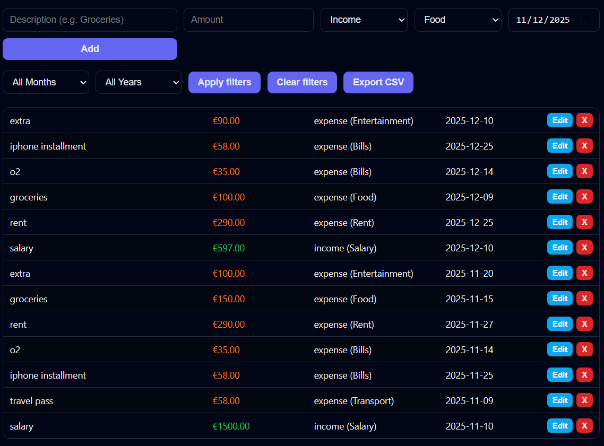

# 💰 Expense Tracker Web App

A modern and user-friendly **expense tracking web application** built using **HTML, CSS, and JavaScript**.  
This project helps users manage income, track expenses, analyze spending by category, filter by month/year, and export financial data — all inside a clean and responsive UI.

Built as part of my journey as an **MSc IT Project Management student** and aspiring **Application Developer** based in Berlin, Germany.

---

## 🚀 Features

### 🧾 Transaction Controls
- Add new income or expense  
- Edit existing transactions  
- Delete transactions  
- Categorize expenses (Food, Rent, Bills, Transport, Entertainment, etc.)

### 📊 Dashboard & Analytics
- **Category-wise expense chart** (dynamic, color-coded)  
- **Top spending category** detection  
- **Current balance**, total income & total expense overview  

### 🔍 Smart Filters
- Filter transactions by **Month**  
- Filter transactions by **Year**  
- Dashboard + chart + list auto-update based on filters  

### 📤 Export & Storage
- Export filtered data to **CSV (Excel-ready)**  
- Data saved using **LocalStorage** → persists even after closing the browser  

---

## 🖼 Screenshots

### 📌 Dashboard Overview

---

### 📌 Transaction List (with Edit + Delete)

---

### 📌 Filtered View (Month-wise)

---

## 🛠 Tech Stack

- **HTML5**
- **CSS3**
- **JavaScript (ES6)**
- **Chart.js** (for data visualisation)

---

## 📁 Project Structure
expense-tracker-app/
│
├── expense-tracker.html # Main application
├── README.md # Project documentation
└── screenshots/ # UI screenshots
├── dashboard.png
├── list.png
└── filtered.png

---

## 🎯 What I Learned

- JavaScript state management  
- DOM handling for dynamic UI updates  
- Building editable forms  
- Using Chart.js for real-time visual analytics  
- Creating filters and CSV export functionality  
- Designing user-friendly front-end UI/UX  

---

## 🔮 Future Improvements

- Cloud sync using Firebase  
- User authentication  
- Budget limit alerts  
- Monthly reports & trends  
- Light/Dark theme toggle  

---

## 📬 Contact

Built by **Dhruv**  
MSc IT Project Management  
Berlin, Germany 🇩🇪  

If you found this project helpful, feel free to ⭐ the repo!

